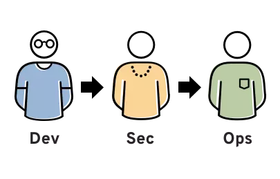
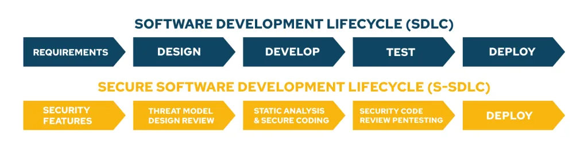
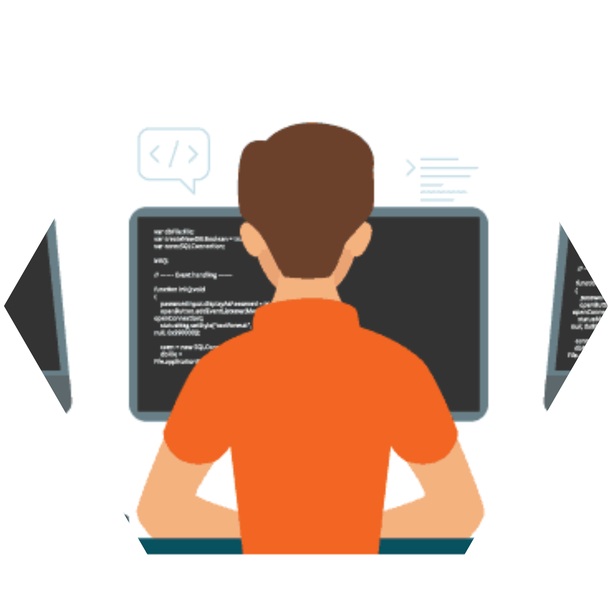
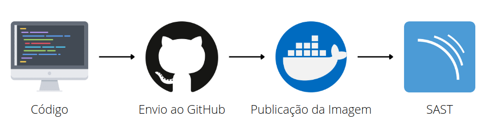
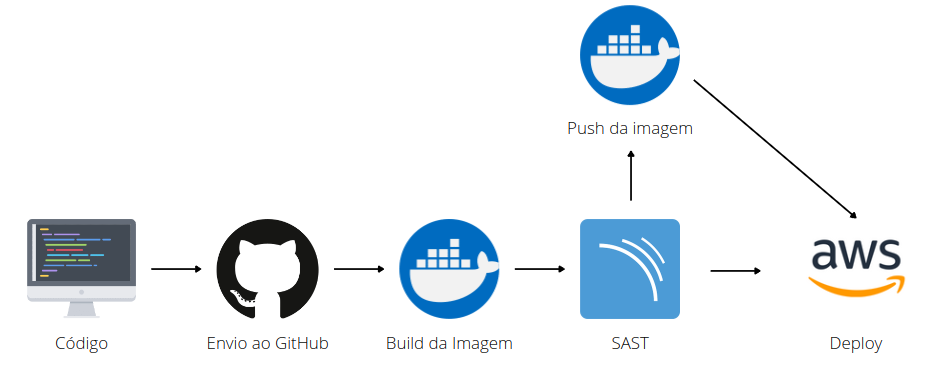
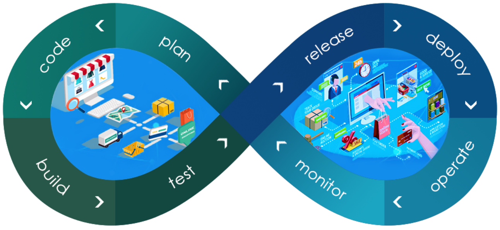

---

marp: true
theme: uncover
paginate: true
backgroundColor: #fff
color: #fff
colorSecondary: #423864
backgroundImage: url('images/main-background.png')
style: |
    section{
      font-family: "Helvetica", monospace;
    }
    section::after {
      font-weight: bold;
      content: attr(data-marpit-pagination) '/' attr(data-marpit-pagination-total);
      font-size: 13pt;
      color: #fff;
      text-shadow: 1px 1px 0 #000;
    }    
---

<!-- _backgroundImage: "url('images/title-background.png')" -->
<!-- _paginate: false -->
#

## AUMENTE A SEGURANÇA DE SUAS APLICAÇÕES COM **SOFTWARE LIVRE**
Samuel Gonçalves

---

<!-- _backgroundImage: "url('images/quote-background.png')" -->
<!-- _paginate: false -->
> ## *O espírito humano precisa prevalecer sobre a tecnologia.*

*Albert Einstein*

---

#### 🇧🇷 Samuel Gonçalves Pereira

* Consultor de Tecnologia nas áreas **Segurança Ofensiva** e **DevSecOps**
* Mais de 10 anos de experiência 💻
* *"3k++"* alunos ensinados no 🌎
* Músico, Contista, YouTuber e Podcaster
* Apaixonado por Software Livre 💙

---

### Vamos nos conectar? 
É só escanear ou acessar o link:
[https://beacons.ai/sgoncalves](https://beacons.ai/sgoncalves)

---

### SORTEIO NO FIM DA PALESTRA!
##### Inscreva-se e participe!

---

<!-- _backgroundImage: "url('images/background-hacker.png')" -->
<!-- _paginate: false -->
# **Precisamos** falar de
## SEGURANÇA!

---

## Princípios da segurança

Também conhecidos por **CID**, são:

**Confiabilidade**, **Integridade** e **Disponibilidade**.

Se algum  desdes principios falhar, teremos uma falha de segurança em nossa aplicação.

---

## Segurança do início ao fim!

É importante trazer a segurança para o projeto deste o início do processo. Esta abordagem é conhecida como **Secure Shift Left**.

---

## 1° Fase: *Requisitos*

Nesta fase vamos nos preocupar com os princípios da segurança em cada um dos requisitos levantados, nos atentando ao processo de desenvolvimento seguro.

---

## 2° Fase: *Design*

Vamos utilizar o **Threat Modelling**, ou **Modelagem de Ameaças**. Levantaremos pontos como:

* Haverá interação com aplicação externa?
* Esta aplicação externa, possui alguma vulnerabilidade?
* Qual versão do banco de dados será utilizado?
* Qual tipo de autenticação utilizada pela API?

---

## 3° Fase: *Develop*

O foco é: evitar vulnerabilidades, para isso podemos usar recursos como a **OWASP Top 10**, a **OWASP API** e **Code Review Guide**.
#
Vamos validar *inputs*, verificar de nossas APIs estão usando autenticação, se os métodos utilizados estão corretos...
#
O uso de scanners de código diretamente na IDE, como o SonarLint, é recomendado.

---

## 4° Fase: *Test*

Esta etapa contempla o **Code Review**, que visa encontrar vulnerabilidades no código fonte da aplicação, bem como realizar o **SAST** (Teste estático), com o mesmo objetivo. Existem várias ferramentas opensource para esta etapa, sempre baseadas em linguagem de programação.

---

### Ferramentas para SAST

Ferramenta        | Linguagem               | Link para acesso
:---------------: |:-----------------------:|:----------------:
Brakeman          | Ruby                    | [https://brakemanscanner.org/](https://brakemanscanner.org/)
SonarQube         | 27 linguagens           | [https://www.sonarqube.org/](https://www.sonarqube.org/)
Bandit            | Python                  | [https://pypi.org/project/bandit/](https://pypi.org/project/bandit/)
Horusec           | Várias linguagens       | [https://horusec.io/](https://horusec.io/site/)
CPPCheck          | C++                     | [http://cppcheck.sourceforge.net/](http://cppcheck.sourceforge.net/)
Graudit           | Groovy                  | [https://github.com/wireghoul/graudit](https://github.com/wireghoul/graudit)
Dependency Check (SCA) | Dependências de Código  | [https://owasp.org/www-project-dependency-check/](https://owasp.org/www-project-dependency-check/)

---

## 5° Fase: *Deploy*

Antes do deploy é crucial fazer um **Pentest**, ou mesmo o **DAST** *(Teste Dinâmico)*. O objetivo é estressas a aplicação ao máximo para descobrir falhas que não foram vistas nas etapas anteriores. 

Outro ponto importante é o **Hardening** das instâncias que executam a aplicação.

---

### Ferramentas para DAST

Ferramenta       | Link para acesso
:---------------:|:----------------:
OWASP ZAP        | [https://owasp.org/www-project-zap/](https://owasp.org/www-project-zap/)
Arachni          | [https://www.arachni-scanner.com/](https://www.arachni-scanner.com/)
SQLmap           | [http://sqlmap.org/](http://sqlmap.org/)
Gauntlt          | [http://gauntlt.org/](http://gauntlt.org)
BDD Security     | [https://github.com/iriusrisk/bdd-security](https://github.com/iriusrisk/bdd-security)
Nikto            | [https://github.com/sullo/nikto](https://github.com/sullo/nikto)
Golismero        | [https://github.com/golismero/golismero](https://github.com/golismero/golismero)

---

### Integração Contínua
#

**CI** → Integração contínua está ligada ao processo de automação. 

---

### Deploy Contínuo
#

**CD** → Deploy contínuo está ligado ao lançamento automático em ambiente produtivo. 

---

## Dev**Sec**Ops

---

## Dúvidas?

---

### Obrigado!

Vamos nos conectar?
* **Site:** [sgoncalves.tec.br](https://sgoncalves.tec.br)
* **E-mail:** [samuel@sgoncalves.tec.br](https://sgoncalves.tec.br/contato)
* **Linkedin:** [linkedin.com/in/samuelgoncalvespereira/](linkedin.com/in/samuelgoncalvespereira/)
* **Telegram:** [t.me/Samuel_gp](t.me/Samuel_gp)
* **Todas as redes:** [https://beacons.ai/sgoncalves](https://beacons.ai/sgoncalves)

---

### Fontes Bibliográficas

[https://promovesolucoes.com/devsecops-seguranca-continua-lgpd/](https://promovesolucoes.com/devsecops-seguranca-continua-lgpd/)
[https://www.redhat.com/pt-br/topics/devops/what-is-devsecops](https://www.redhat.com/pt-br/topics/devops/what-is-devsecops)
[https://www.ibm.com/br-pt/cloud/learn/devsecops](https://www.ibm.com/br-pt/cloud/learn/devsecops)
[https://promovesolucoes.com/devsecops-seguranca-continua-lgpd/](https://promovesolucoes.com/devsecops-seguranca-continua-lgpd/)
[https://4linux.com.br/cursos/treinamento/devsecops-seguranca-em-infraestrutura-e-desenvolvimento-agil/](https://4linux.com.br/cursos/treinamento/devsecops-seguranca-em-infraestrutura-e-desenvolvimento-agil/)
[https://blog.4linux.com.br/devsecops-implementacao-em-6-passos/](https://blog.4linux.com.br/devsecops-implementacao-em-6-passos/)
[https://blog.gitguardian.com/security-tools-shift-left/](https://blog.gitguardian.com/security-tools-shift-left/)
[https://michelleamesquita.medium.com/entendendo-o-ciclo-de-vida-de-desenvolvimento-de-software-seguro-ssdlc-ccc173f583de](https://michelleamesquita.medium.com/entendendo-o-ciclo-de-vida-de-desenvolvimento-de-software-seguro-ssdlc-ccc173f583de)